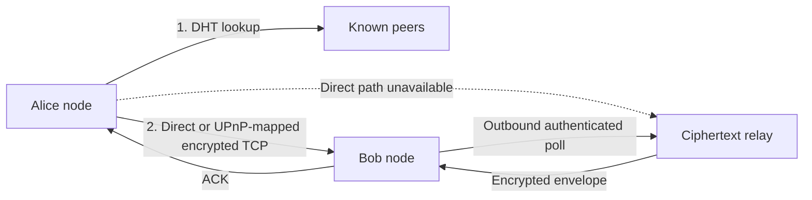

# CNP2P — Encrypted Peer-to-Peer Chat

CNP2P is an educational peer-to-peer chat application written in Python. Every
running instance is a network node: it accepts connections, discovers peers,
answers distributed lookups, and sends end-to-end encrypted messages directly
whenever the destination is reachable.

When direct delivery is blocked by NAT or the recipient is offline, the sender
can place the encrypted envelope on a configured relay. The relay stores only
ciphertext and cannot decrypt the conversation.

## Features

- Persistent, key-derived 160-bit node identities
- Ed25519 signatures and authenticated peer records
- X25519 key agreement with HKDF-SHA256 key derivation
- ChaCha20-Poly1305 authenticated message encryption
- Direct TCP delivery with acknowledgements and retries
- Duplicate-message suppression
- Manual bootstrap and UDP local-network discovery
- Kademlia-inspired routing and iterative node lookup
- Relay-assisted connectivity for NAT-restricted nodes
- Persistent encrypted offline-message queues
- Signed relay fetch and deletion requests
- Optional RFC 5389 STUN endpoint diagnostics
- Automatic UPnP IGD TCP mapping with renewal and clean shutdown
- Minimal Electron desktop interface with an isolated renderer
- Standalone Windows builds with the Python networking engine embedded
- Bounded protocol frames, routing-table cleanup, and relay expiry limits

## Contents

- [Requirements](#requirements)
- [Desktop app](#desktop-app)
- [Command-line installation](#command-line-installation)
- [First local chat](#first-local-chat)
- [Chat over a LAN](#chat-over-a-lan)
- [Relay, NAT, and offline messaging](#relay-nat-and-offline-messaging)
- [STUN diagnostics](#stun-diagnostics)
- [Interactive commands](#interactive-commands)
- [Command-line options](#command-line-options)
- [How the network works](#how-the-network-works)
- [Identity and encryption](#identity-and-encryption)
- [Data files and backups](#data-files-and-backups)
- [Testing](#testing)
- [Troubleshooting](#troubleshooting)
- [Limitations](#limitations)

## Requirements

- Python 3.11 or newer
- `pip`
- Git, if cloning from GitHub
- Node.js 20 or newer and npm, only for the Electron app
- A reachable TCP port for nodes accepting direct connections
- A publicly reachable machine only when operating an Internet relay

The only third-party Python dependency is
[`cryptography`](https://cryptography.io/). It is installed automatically by
`pip` from `pyproject.toml`.

Check the installed tools:

```powershell
python --version
python -m pip --version
git --version
node --version
npm --version
```

On systems where Python 3 is invoked as `python3`, substitute `python3` for
`python` in the commands below.

## Desktop app

The Electron app is the simplest way to use CNP2P. It keeps the interface to a
small two-pane layout: peers on the left, the selected encrypted conversation
on the right, and advanced network details in Settings.

### Run from source on Windows

```powershell
git clone https://github.com/AdityaVKochar/p2p-chat.git
cd p2p-chat

python -m venv .venv
Set-ExecutionPolicy -Scope Process -ExecutionPolicy Bypass
.venv\Scripts\Activate.ps1
python -m pip install --upgrade pip
python -m pip install -e ".[desktop]"

npm install
npm start
```

### Run from source on macOS or Linux

```bash
git clone https://github.com/AdityaVKochar/p2p-chat.git
cd p2p-chat

python3 -m venv .venv
source .venv/bin/activate
python -m pip install --upgrade pip
python -m pip install -e ".[desktop]"

npm install
npm start
```

On first launch, enter a display name. Open Settings to configure a bootstrap
peer, encrypted relay, STUN server, LAN discovery, or automatic port mapping.

### Build the Windows installer

```powershell
python -m pip install -e ".[desktop]"
npm install
npm run build:win
```

The NSIS installer is written to `release/`. PyInstaller first bundles the
Python networking engine, cryptography library, and SQLite support; Electron
then embeds that executable. Users of the finished Windows build do not need
Python or Node.js.

For a faster unpacked packaging check:

```powershell
npm run build:dir
```

## Command-line installation

### Windows PowerShell

```powershell
git clone https://github.com/AdityaVKochar/p2p-chat.git
cd p2p-chat

python -m venv .venv
Set-ExecutionPolicy -Scope Process -ExecutionPolicy Bypass
.venv\Scripts\Activate.ps1

python -m pip install --upgrade pip
python -m pip install -e .
```

The execution-policy command only affects the current PowerShell process. If
virtual-environment activation is already permitted, it may be omitted.

### Windows Command Prompt

```bat
git clone https://github.com/AdityaVKochar/p2p-chat.git
cd p2p-chat

python -m venv .venv
.venv\Scripts\activate.bat

python -m pip install --upgrade pip
python -m pip install -e .
```

### macOS and Linux

```bash
git clone https://github.com/AdityaVKochar/p2p-chat.git
cd p2p-chat

python3 -m venv .venv
source .venv/bin/activate

python -m pip install --upgrade pip
python -m pip install -e .
```

Verify the installation:

```powershell
cnp2p --help
```

If the `cnp2p` command is not found, ensure the virtual environment is active,
or run the equivalent module command:

```powershell
python -m cnp2p --help
```

## First local chat

This example runs two independent nodes on one computer. Each node must use a
different port and data directory.

Open terminal 1:

```powershell
cd p2p-chat
.venv\Scripts\Activate.ps1
cnp2p --name Alice --host 127.0.0.1 --advertise-host 127.0.0.1 --port 9101 --data-dir .demo/alice --no-lan
```

Open terminal 2:

```powershell
cd p2p-chat
.venv\Scripts\Activate.ps1
cnp2p --name Bob --host 127.0.0.1 --advertise-host 127.0.0.1 --port 9102 --data-dir .demo/bob --bootstrap 127.0.0.1:9101 --no-lan
```

On Bob's prompt, list the routing table:

```text
/peers
```

Copy Alice's node ID or use its unique displayed prefix:

```text
/msg ALICE_ID_PREFIX Hello Alice
```

Alice can reply using Bob's ID prefix. A successful direct message prints an
encrypted-delivery acknowledgement.

## Chat over a LAN

Nodes on the same local network can discover one another through UDP broadcast.
Start a node on each computer:

```powershell
cnp2p --name Alice --port 9000 --data-dir .cnp2p/alice
```

```powershell
cnp2p --name Bob --port 9000 --data-dir .cnp2p/bob
```

Wait several seconds, then run `/peers`. If broadcast discovery is blocked by
the network or operating-system firewall, bootstrap Bob with Alice's LAN IP:

```powershell
cnp2p --name Bob --port 9000 --data-dir .cnp2p/bob --bootstrap 192.168.1.20:9000
```

The receiving computer must permit inbound TCP traffic on the selected node
port. LAN discovery uses UDP port `37020`.

## Relay, NAT, and offline messaging

Direct TCP is always attempted first. With automatic port mapping enabled, a
compatible UPnP IGD gateway maps the listening TCP port; CNP2P advertises the
public endpoint, renews finite leases, and removes the mapping on clean
shutdown. If that path fails, both clients create outbound TCP connections to
the relay. This fallback works behind most NAT devices and restrictive inbound
firewalls.

### 1. Start a relay

Run this on a publicly reachable computer or server:

```bash
git clone https://github.com/AdityaVKochar/p2p-chat.git
cd p2p-chat
python3 -m venv .venv
source .venv/bin/activate
python -m pip install -e .

cnp2p \
  --name PublicRelay \
  --host 0.0.0.0 \
  --advertise-host relay.example.org \
  --port 9100 \
  --data-dir .relay \
  --relay-server \
  --no-lan
```

Allow inbound TCP port `9100` in the server firewall and cloud security group.
The relay queue is persisted in `.relay/relay.sqlite3`.

### 2. Configure the clients

Alice:

```powershell
cnp2p --name Alice --port 9101 --data-dir .alice --bootstrap relay.example.org:9100 --relay relay.example.org:9100
```

Bob:

```powershell
cnp2p --name Bob --port 9102 --data-dir .bob --bootstrap relay.example.org:9100 --relay relay.example.org:9100
```

Use the relay's actual hostname or public IP address in place of
`relay.example.org`.

### 3. Test offline delivery

1. Start Alice and Bob once so their signed peer records enter the routing
   network.
2. Stop Alice with `/quit`.
3. From Bob, send a message to Alice's node ID.
4. Bob first attempts direct delivery and then reports that the encrypted
   message was queued at the relay.
5. Restart Alice with the same `--data-dir` and `--relay` options.
6. Alice automatically polls the relay and decrypts the message locally.

Fetch immediately instead of waiting for the polling interval:

```text
/offline
```

Queued envelopes expire after seven days. A relay stores at most 1,000
envelopes for each recipient. Successful retrieval is followed by a signed
deletion request from the recipient.

## STUN diagnostics

STUN is optional and is used only to observe the public UDP address assigned by
a NAT device. Supply an RFC 5389-compatible server explicitly:

```powershell
cnp2p --name Alice --port 9101 --data-dir .alice --stun stun.example.org:3478
```

At the prompt:

```text
/nat
```

The result is diagnostic. This project does not implement direct ICE/TCP hole
punching. UPnP is the automatic direct-mapping path, and the configured relay
is the fallback when the gateway does not support mapping.

## Interactive commands

| Command | Description |
| --- | --- |
| `/id` | Display the complete local node ID. |
| `/peers` | List peers in the local routing table. |
| `/connect HOST:PORT` | Bootstrap through another running node. |
| `/find NODE_ID` | Perform a distributed lookup for a complete node ID. |
| `/msg ID_OR_PREFIX MESSAGE` | Encrypt and send a message. |
| `/ping ID_OR_PREFIX` | Check direct reachability and round-trip time. |
| `/offline` | Poll configured relays for queued messages immediately. |
| `/nat` | Query the configured STUN server. |
| `/help` | Display command help. |
| `/quit` | Stop the node cleanly. |

Quotes may be used when the shell-like command parser needs to preserve spaces:

```text
/msg 8ac441 "This message is encrypted end to end"
```

## Command-line options

```text
--name NAME                    Required display name
--host HOST                    Local TCP bind address; default 0.0.0.0
--port PORT                    Local TCP listen port; default 9000
--advertise-host HOST          Address other peers should use
--bootstrap HOST:PORT          Initial peer; may be repeated
--data-dir DIRECTORY           Identity and relay-data directory
--relay HOST:PORT              Offline/NAT relay; may be repeated
--relay-server                 Enable persistent relay service on this node
--stun HOST:PORT               STUN server used by /nat
--upnp                         Request automatic TCP mapping from the router
--no-lan                       Disable UDP LAN discovery
```

Display the authoritative help for the installed version:

```powershell
cnp2p --help
```

## How the network works



Each node occupies a 160-bit keyspace. Its routing table groups known peers by
XOR distance in Kademlia-style buckets. A lookup queries up to three of the
closest unqueried nodes in each round and incorporates the signed peer records
they return.

Protocol frames are newline-delimited JSON over TCP:

- `HELLO` exchanges authenticated peer records.
- `FIND_NODE` and `NODES` perform distributed discovery.
- `CHAT` carries an encrypted envelope; plaintext is never placed in the frame.
- `ACK` confirms direct receipt.
- `RELAY_STORE` queues signed ciphertext.
- `RELAY_FETCH` and `RELAY_DELETE` require recipient signatures.

UDP broadcast is used only for LAN peer announcements; it never carries chat
content.

## Identity and encryption

On first startup, the node creates an Ed25519 signing key and an X25519
key-agreement key. The node ID is derived from the Ed25519 public key. The
identity signs the X25519 public key and relay capability, preventing silent key
substitution in a peer record.

For each message:

1. The sender performs X25519 key agreement with the recipient's public key.
2. HKDF-SHA256 derives a message-specific 256-bit key.
3. ChaCha20-Poly1305 encrypts and authenticates the text and timestamp with a
   fresh nonce.
4. Ed25519 signs the sender, recipient, message ID, nonce, and ciphertext.
5. The recipient verifies the signature before decrypting.

The relay can observe metadata—including node IDs, message size, and timing—but
does not possess the key required to decrypt the text. See
[`docs/security-model.md`](docs/security-model.md) for the complete security
boundary.

## Data files and backups

The directory supplied through `--data-dir` contains:

| File | Purpose |
| --- | --- |
| `identity.json` | Long-term Ed25519 and X25519 private keys. |
| `relay.sqlite3` | Ciphertext queue, only on relay-enabled nodes. |

Do not commit data directories. The included `.gitignore` excludes common
local directories such as `.cnp2p/` and `.venv/`.

Treat `identity.json` like a password or private SSH key:

- Do not send it to another person.
- Do not place it in cloud-synced public folders.
- Back it up securely if the node ID must remain stable.
- Use a separate data directory for every node running on the same computer.

Deleting the identity file generates a new identity and node ID on the next
start. Legacy version-1 random-only identities are migrated once to new
key-bound identities.

## Testing

Create the environment and install the project first, then run:

```powershell
python -m unittest discover -s tests -v
```

The tests cover:

- Persistent cryptographic identities
- Confidentiality and ciphertext-tamper rejection
- RFC 5389 XOR-mapped-address parsing
- Three-node discovery and direct encrypted delivery
- Message acknowledgements and duplicate suppression
- Offline encrypted delivery through a persistent relay
- Relay recovery after process restart
- UPnP service discovery, public endpoint advertisement, and mapping cleanup
- XOR-distance routing behavior

Optional syntax compilation check:

```powershell
python -m compileall -q src tests
node --check desktop/main.js
node --check desktop/preload.js
node --check desktop/renderer/renderer.js
npm audit
```

## Project structure

```text
p2p-chat/
├── docs/
│   ├── project-proposal.md
│   └── security-model.md
├── desktop/
│   ├── assets/
│   ├── renderer/
│   ├── main.js
│   └── preload.js
├── scripts/
│   ├── backend_entry.py
│   ├── build-backend.js
│   └── generate-icon.py
├── src/cnp2p/
│   ├── cli.py
│   ├── crypto.py
│   ├── discovery.py
│   ├── identity.py
│   ├── models.py
│   ├── nat.py
│   ├── node.py
│   ├── protocol.py
│   ├── relay.py
│   └── routing.py
├── tests/
├── package.json
├── package-lock.json
├── pyproject.toml
└── README.md
```

## Troubleshooting

### `cnp2p` is not recognized

Activate the virtual environment again or use:

```powershell
python -m cnp2p --name Alice --port 9101 --data-dir .alice
```

### Two local nodes have the same ID

They are using the same data directory. Stop both and restart them with unique
paths:

```powershell
cnp2p --name Alice --port 9101 --data-dir .demo/alice
cnp2p --name Bob --port 9102 --data-dir .demo/bob
```

### Peers do not appear automatically

- Wait at least five seconds for a LAN announcement.
- Confirm both devices are on the same broadcast network.
- Permit UDP port `37020` through the local firewall.
- Use `--bootstrap IP:PORT` if broadcast traffic is filtered.

### A direct message fails

- Run `/ping ID_PREFIX` to check the saved address.
- Confirm the recipient process is running.
- Verify its TCP port is allowed through the firewall.
- Configure the same reachable `--relay HOST:PORT` on both nodes when inbound
  connections are blocked.
- Try `--upnp` or enable automatic port mapping in desktop Settings when the
  router supports UPnP IGD.

### Offline messages are not received

- Restart the recipient with the same `--data-dir`; a new identity cannot read
  messages encrypted for the old identity.
- Confirm the relay address and port are correct.
- Run `/offline` to poll immediately.
- Confirm the relay was started with `--relay-server`.
- Check that the queue has not passed its seven-day expiry.

### Windows firewall

For a development node on TCP port 9101, an elevated PowerShell can add a rule:

```powershell
New-NetFirewallRule -DisplayName "CNP2P TCP 9101" -Direction Inbound -Protocol TCP -LocalPort 9101 -Action Allow
New-NetFirewallRule -DisplayName "CNP2P LAN Discovery" -Direction Inbound -Protocol UDP -LocalPort 37020 -Action Allow
```

Remove those example rules when they are no longer required:

```powershell
Remove-NetFirewallRule -DisplayName "CNP2P TCP 9101"
Remove-NetFirewallRule -DisplayName "CNP2P LAN Discovery"
```

### Linux firewall with UFW

```bash
sudo ufw allow 9100/tcp
sudo ufw allow 37020/udp
sudo ufw status
```

Only expose the ports required for the role of that computer.

## Limitations

This is an educational implementation, not a production messenger.

- Relay operators can observe node IDs, timing, and message sizes.
- Static X25519 identities do not provide forward secrecy after private-key
  compromise.
- Replay suppression is maintained within an active cache window.
- The application does not implement multi-device key management, key
  revocation, direct ICE hole punching, relay federation, traffic-analysis
  resistance, file transfer, or group chat.
- The protocol and cryptographic construction have not received an independent
  security audit.

For the academic abstract and objectives, see
[`docs/project-proposal.md`](docs/project-proposal.md).
